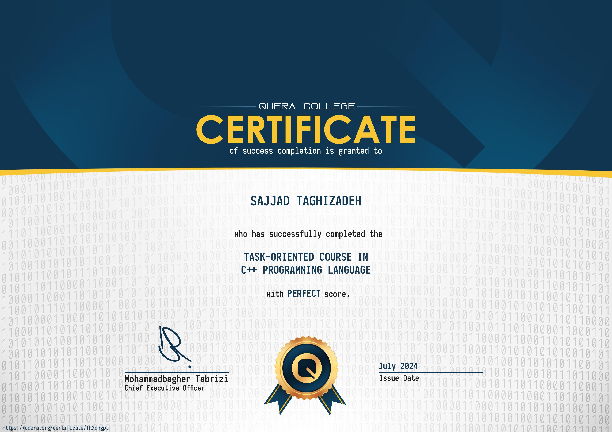
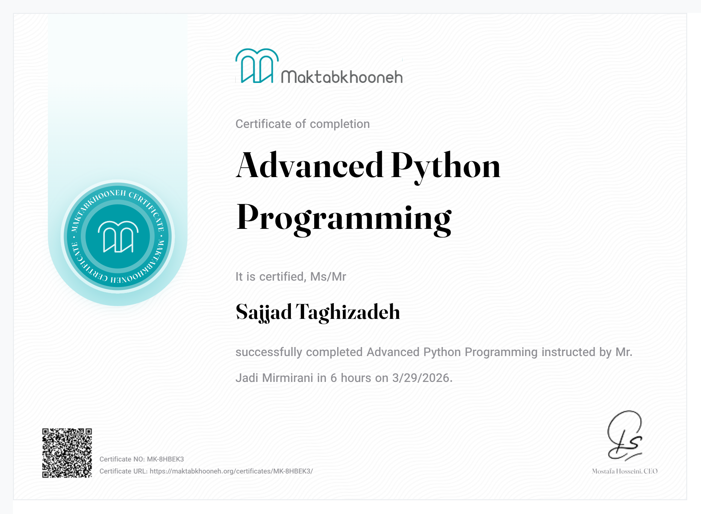
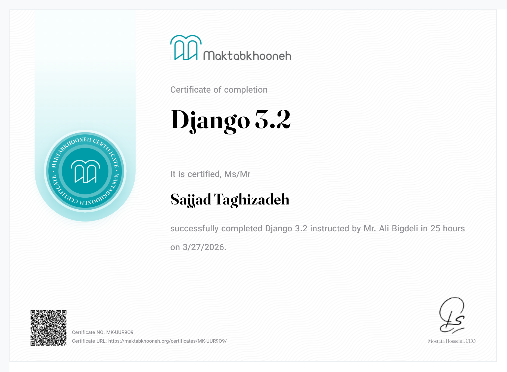
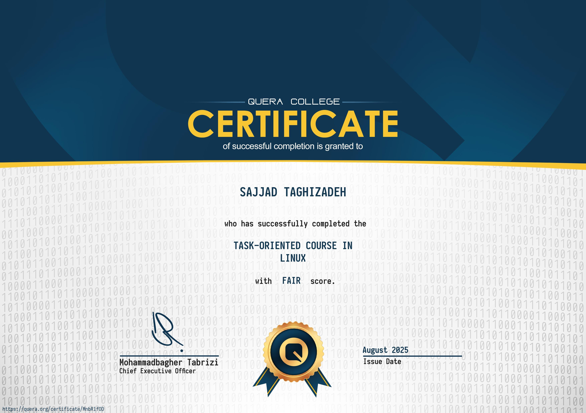
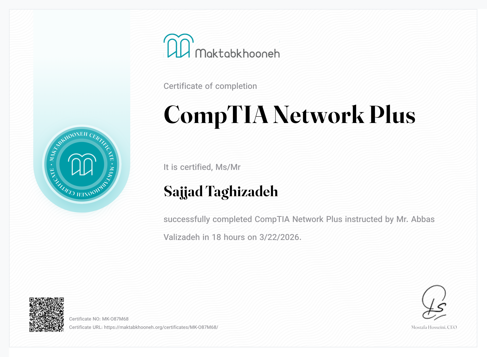
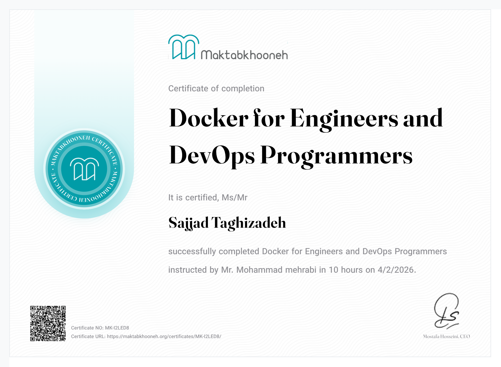

# 📜 Certificates & Applied Projects

This repository contains my earned certificates and the corresponding projects I have implemented to put these skills into practice.

---

## 💻 C++ Programming

  

### 🛠️ Related Projects:
* **[Advanced-Programming](https://github.com/sajadTaghizade/Advanced-Programming):** Implementations of core C++ concepts, OOP, and memory management.
* **[DadeNagar-Project](https://github.com/sajadTaghizade/dadenegar):** Lightweight Object-Oriented Database Management System in C++.
* **[Film-Recommender-System](https://github.com/sajadTaghizade/Film-Recommender-System):** A Smart Movie Recommender System with dual interfaces (CLI & GUI), built with C++ and SFML.
* **[Operating-System](https://github.com/sajadTaghizade/Operating-Systems-Lab):** Operating Systems Lab (xv6).

---

## 🐍 Python & Django Development

  
  

### 🛠️ Related Projects:
* **[Artificial-Intelligence-AI](https://github.com/sajadTaghizade/Artificial-Intelligence-AI):** AI algorithms and machine learning models implemented in Python.
* **[Data-Structure](https://github.com/sajadTaghizade/Data-Structure):** Data Structures Course Projects.
* **[Engineering-Statistics-and-Probability](https://github.com/sajadTaghizade/Engineering-Statistics-and-Probability):** Engineering Statistics & Probability Projects.
* **[machine-learning](https://github.com/sajadTaghizade/machine-_learning1-):** Machine Learning Algorithms Collection.

---

## 🐧 Linux & System Administration

  

### 🛠️ Related Projects:
* **[Operating-System](https://github.com/sajadTaghizade/Operating-Systems-Lab):** Operating Systems Lab (xv6).

---

## 🌐 Network+ (Networking Fundamentals)

  

### 🛠️ Application:
* **Infrastructure Foundation:** Understanding OSI model, TCP/IP, and network security protocols for distributed systems and backend infrastructure.

---

## 🐳 Docker & Containerization

  

### 🛠️ Application:
* **Infrastructure Engineering:** Containerizing applications, managing microservices, and optimizing deployment workflows as part of the infrastructure roadmap.
