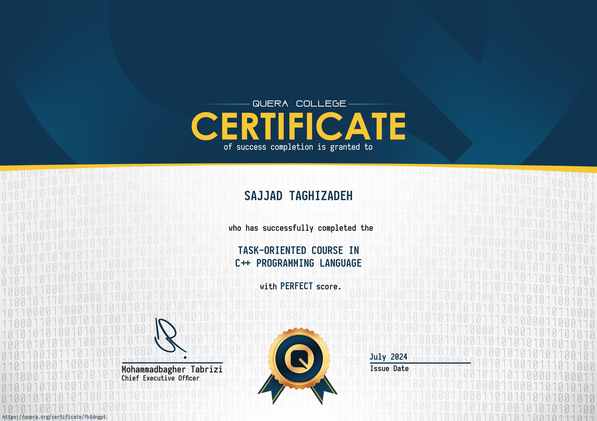
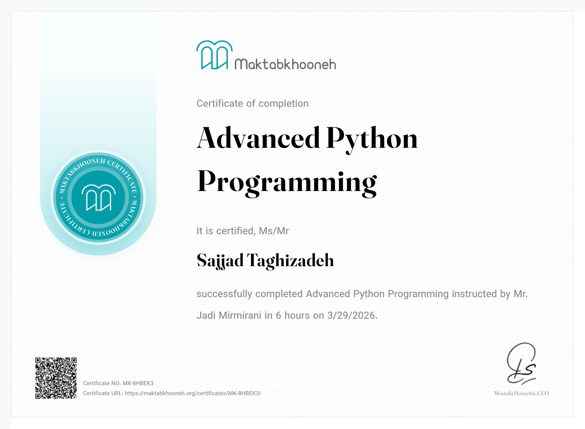
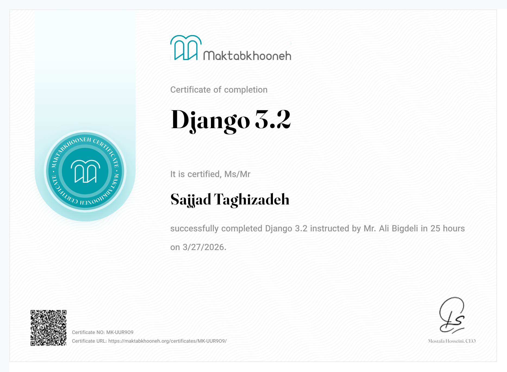
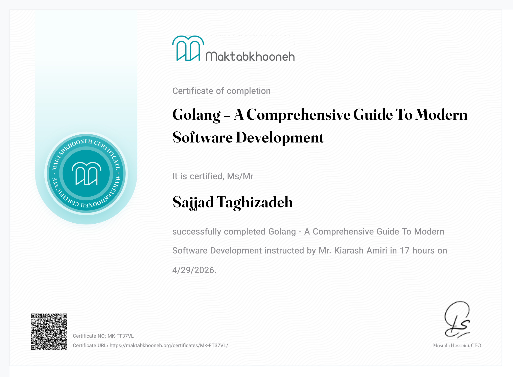
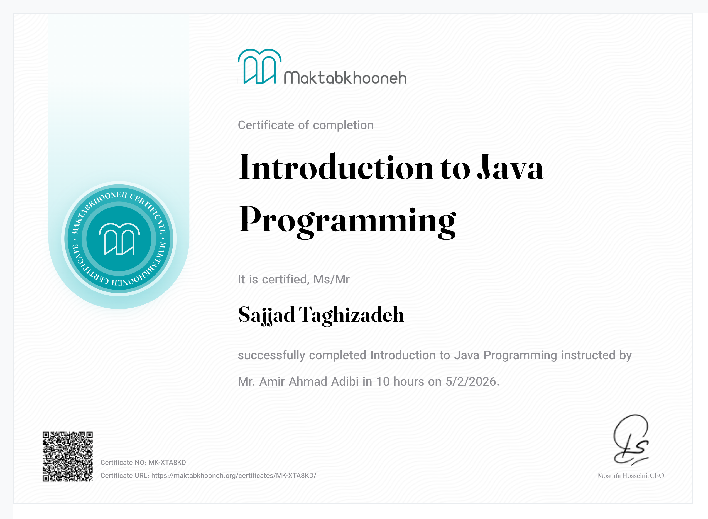
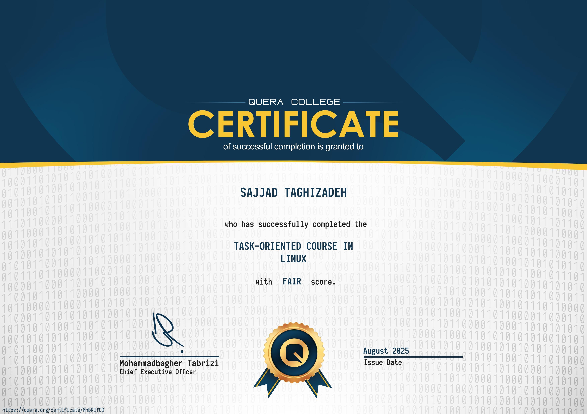
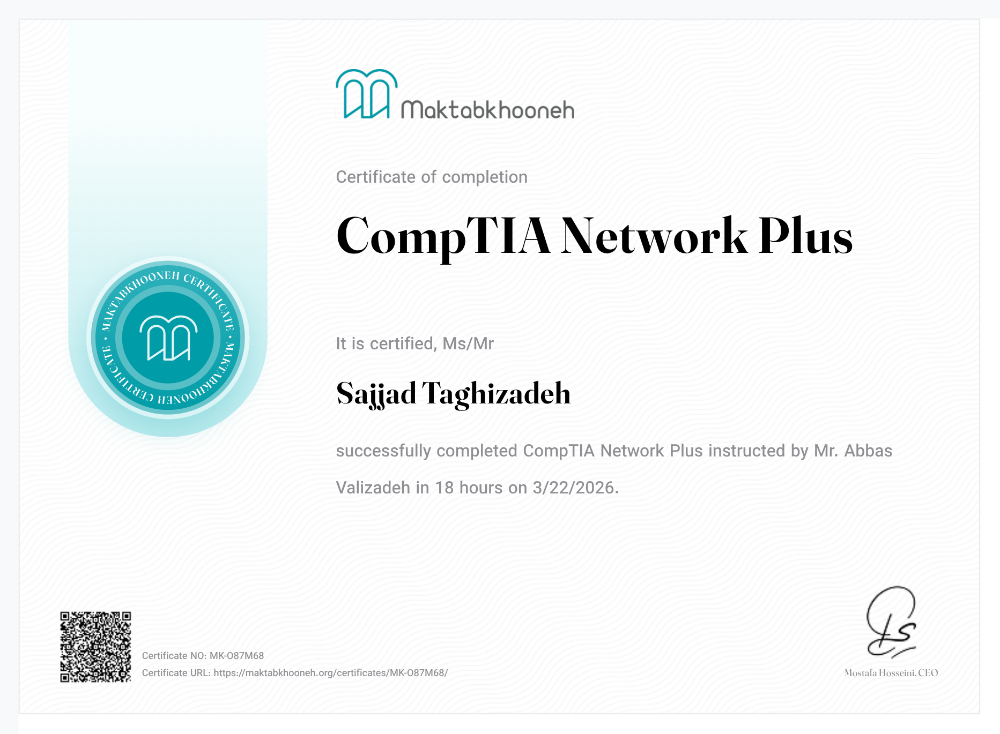
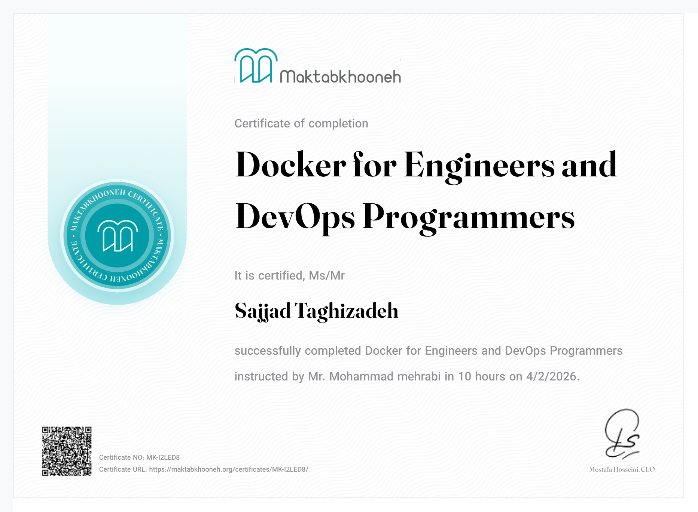

# 📜 Certificates & Applied Projects

This repository contains my earned certificates and the corresponding projects I have implemented to put these skills into practice.

---

## 💻 C/C++ Programming

  

### 🛠️ Related Projects:
* **[Advanced-Programming](https://github.com/sajadTaghizade/Advanced-Programming):** Implementations of core C++ concepts, OOP, and memory management.
* **[DadeNagar-Project](https://github.com/sajadTaghizade/dadenegar):** Lightweight Object-Oriented Database Management System in C++.
* **[Film-Recommender-System](https://github.com/sajadTaghizade/Film-Recommender-System):** A Smart Movie Recommender System with dual interfaces (CLI & GUI), built with C++ and SFML.
* **[Operating-System-Lab](https://github.com/sajadTaghizade/Operating-Systems-Lab):** Operating Systems Lab (xv6).
* **[Operating-System](https://github.com/sajadTaghizade/Operating-System):** Socket-based flight reservation system, a Linux shell with named/unnamed pipes, and a thread-synchronization + CPU-scheduling simulator.

---

## 🐍 Python & Django Development

  
  

### 🛠️ Related Projects:
* **[Artificial-Intelligence-AI](https://github.com/sajadTaghizade/Artificial-Intelligence-AI):** AI algorithms and machine learning models implemented in Python.
* **[Data-Structure](https://github.com/sajadTaghizade/Data-Structure):** Data Structures Course Projects.
* **[Engineering-Statistics-and-Probability](https://github.com/sajadTaghizade/Engineering-Statistics-and-Probability):** Engineering Statistics & Probability Projects.
* **[machine-learning](https://github.com/sajadTaghizade/machine-learning):** Machine Learning Algorithms Collection.
* **[Data-Science](https://github.com/sajadTaghizade/Data-Science):** EDA, BI dashboards, Kafka/Spark streaming, CatBoost, and a team-built Stack Overflow similar-question recommender.
* **[Computer-Vision](https://github.com/sajadTaghizade/Computer-Vision):** OpenCV fundamentals, a full CAPTCHA-breaking pipeline, CNN scene classification, and a U-Net photo-restoration model.

---

## 🐹 Golang Development

  

### 🛠️ Application & Related Projects:
* **Backend & Microservices:** Building scalable backend architectures and concurrent services utilizing Go's goroutines and channels.
* **[Distributed-Systems](https://github.com/sajadTaghizade/Distributed-Systems):** IPC/RPC to a multi-VM system with Pub/Sub to a replicated key-value store (eventual vs. strong consistency), built in Go.

---

## ☕ Java Development

  

### 🛠️ Related Projects:
* **[Programming-Languages-And-Compiler-Design](https://github.com/sajadTaghizade/Programming-Languages-And-Compiler-Design):** A full compiler for the MOL language — ANTLR lexer/parser, AST, name/type analysis, and JVM bytecode generation.
* **[Internet-Engineering](https://github.com/sajadTaghizade/Internet-Engineering):** A hand-rolled Java HTTP server evolved into a REST API, a React frontend, Postgres persistence, JWT auth, and a Dockerized deployment.

---

## 🧮 MATLAB & Signal Processing

### 🛠️ Related Projects:
* **[Signals-and-systems](https://github.com/sajadTaghizade/Signals-and-systems):** Comprehensive implementations in MATLAB covering Signal & Image Processing, Digital Communications (ASK/FSK), Steganography, and Machine Learning (SVM).

---

## 🐧 Linux & System Administration

  

### 🛠️ Related Projects:
* **[Operating-System](https://github.com/sajadTaghizade/Operating-Systems-Lab):** Operating Systems Lab (xv6).

---

## 🌐 Network+ (Networking Fundamentals)

  

### 🛠️ Related Projects:
* **[Computer-Networks](https://github.com/sajadTaghizade/Computer-Networks):** ns-3 WiFi simulation (802.11ac/ax) and GNS3 router topologies with static IP routing.

---

## 🐳 Docker & Containerization

  

### 🛠️ Related Projects:
* **[Internet-Engineering](https://github.com/sajadTaghizade/Internet-Engineering):** Multi-stage Docker builds for a Java backend and a React frontend, wired together with Docker Compose behind an Nginx reverse proxy.
* **[Distributed-Systems](https://github.com/sajadTaghizade/Distributed-Systems):** A multi-stage, zero-dependency `scratch`-based Docker image for a Go HTTP microservice.
* **[Data-Science](https://github.com/sajadTaghizade/Data-Science):** Docker and Kubernetes manifests for the final project's data pipeline, run in CI on every push.
